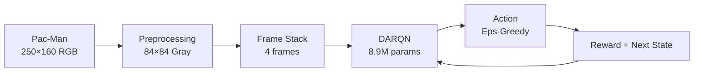
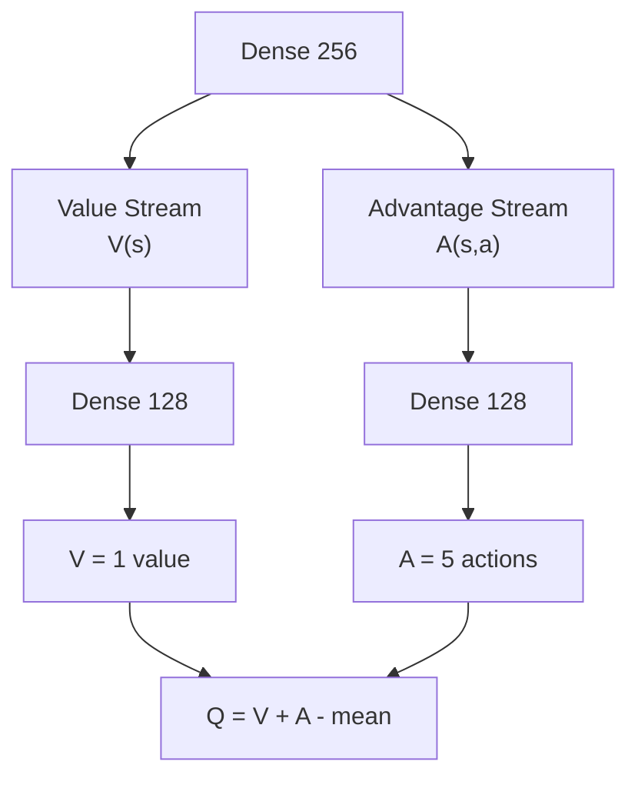
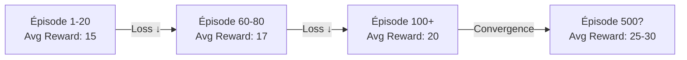
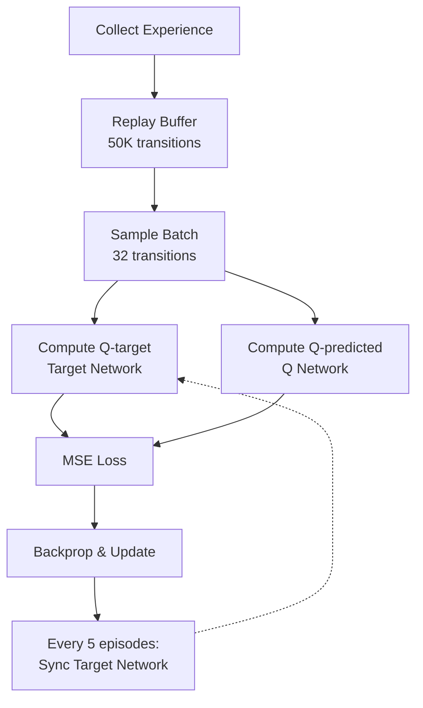

# DARQN : Agent Pac-Man par Deep Reinforcement Learning

Agent IA jouant Pac-Man avec :
- **CNN** : reconnaître les objets du jeu
- **CBAM** : attention (focus sur ce qui importe)
- **LSTM** : prédire le mouvement des fantômes
- **Dueling DQN** : séparer valeur de l'état et avantage des actions

https://github.com/user-attachments/assets/1506fef2-52f8-4ad4-8ea4-0426ab4d2f37

**Versions disponibles :**
- **TensorFlow/Keras** : `DARQN_gym_pacman.py` (version principale)
- **PyTorch** : `DARQN_gym_pacman_pytorch.py` (version expérimentale avec GPU CUDA)



---

## 🎮 Que fait chaque couche du réseau

### **Input (84×84, 4 canaux)**
- 4 frames empilées = montrer le mouvement
- Pac-Man à droite sur 4 images = l'agent voit la vélocité

### **Conv1 (8×8, stride=4) → 32 filtres**
- Reconnaît les patterns grossiers : murs, pellets, fantômes, Pac-Man
- "Où sont les objets ?"

### **Conv2 (4×4, stride=2) → 64 filtres**
- Combine les patterns en situations tactiques
- "Y a-t-il un danger ? Un bonus à proximité ?"

### **Conv3 (3×3, stride=1) → 128 filtres**
- Détails fins, positions précises
- "Où exactement sont les choses ?"

### **CBAM : Attention**

**Channel Attention** : "Quelles features importent ?"
- GlobalAvgPool + GlobalMaxPool sur les 128 canaux
- FC layers apprennent les poids
- Réseau peut ignorer les murs et focus sur les fantômes

**Spatial Attention** : "Quelles positions importent ?"
- Crée une heatmap : "Voilà où l'action se passe"
- Conv2D (7×7) apprend les patterns spatiaux

### **LSTM : Dynamiques temporelles**

- LSTM1 (256 units) + LSTM2 (128 units)
- CNN dit où sont les choses
- LSTM prédit où elles vont
- "Les fantômes tournent à droite puis à gauche" = pattern appris

### **Dense Layers : Stratégie**

- Combine CNN (spatial) + LSTM (temporal)
- Apprend les décisions : "Ghost à gauche ET rapide → fuis vers le haut"

### **Dueling DQN : Deux flux de décision**

**Value Stream V(s)** : "Cet état est-il bon ?"
- 1 nombre
- État sûr = V(s) = +2.5
- État piégé = V(s) = -1.8

**Advantage Stream A(s,a)** : "Quelle action est meilleure ?"
- 5 nombres (UP, RIGHT, LEFT, DOWN, NOOP)
- UP = +1.0 (escape!), DOWN = -0.5 (vers fantôme)

**Formule** : `Q(s,a) = V(s) + [A(s,a) - mean(A)]`



---

## 🏗️ Architecture

| Couche | Config | Raison |
|--------|--------|--------|
| Conv1 | 8×8 stride=4, 32 filtres | Patterns larges |
| Conv2 | 4×4 stride=2, 64 filtres | Features mid-level |
| Conv3 | 3×3 stride=1, 128 filtres | Détails fins |
| CBAM | ratio=8, kernel=7 | Balance capacité/computation |
| LSTM1-2 | 256 → 128 | Dynamiques temporelles |
| Dense1-2 | 512 → 256 | Apprentissage stratégique |
| Dueling | Value(1) + Advantage(5) | Séparation value/action |

---

## 📊 Paramètres du modèle

```
Total: 8,905,305 params (33.97 MB)
Trainable: 8,904,857 (99.99%)
Non-trainable: 448 (BatchNorm)
```

---

## 📈 Résultats d'entraînement

### Version TensorFlow/Keras

#### Progression d'apprentissage



#### Statistiques actuelles (100 épisodes)

```
====================================================================================================
Model checkpoint saved at episode 140
Reward -> Best: 101 | Avg (last 20): 18
Loss   -> Avg (last 20): 0.010264
====================================================================================================

Episode: 141/500 | Original: 26 | Custom: 26 | Eps: 0.493 | Time: 75.18s | Steps: 564 | Memory: 50000
  └─ Loss -> Avg: 0.010111 | Min: 0.000405 | Max: 0.155882 | Trainings: 141
Episode: 142/500 | Original: 28 | Custom: 28 | Eps: 0.491 | Time: 67.59s | Steps: 459 | Memory: 50000
  └─ Loss -> Avg: 0.009014 | Min: 0.000195 | Max: 0.035159 | Trainings: 114
Episode: 143/500 | Original: 44 | Custom: 44 | Eps: 0.488 | Time: 106.05s | Steps: 786 | Memory: 50000
  └─ Loss -> Avg: 0.010210 | Min: 0.000892 | Max: 0.154305 | Trainings: 196
Episode: 144/500 | Original: 6 | Custom: 6 | Eps: 0.486 | Time: 37.86s | Steps: 290 | Memory: 50000
  └─ Loss -> Avg: 0.009773 | Min: 0.000297 | Max: 0.035695 | Trainings: 72
Episode: 145/500 | Original: 21 | Custom: 21 | Eps: 0.483 | Time: 55.18s | Steps: 400 | Memory: 50000
  └─ Loss -> Avg: 0.011199 | Min: 0.000217 | Max: 0.166430 | Trainings: 100
Episode: 146/500 | Original: 18 | Custom: 18 | Eps: 0.481 | Time: 44.66s | Steps: 382 | Memory: 50000
  └─ Loss -> Avg: 0.046978 | Min: 0.001104 | Max: 2.505190 | Trainings: 95
Episode: 147/500 | Original: 11 | Custom: 11 | Eps: 0.479 | Time: 39.31s | Steps: 330 | Memory: 50000
  └─ Loss -> Avg: 0.010871 | Min: 0.000445 | Max: 0.040807 | Trainings: 82
Episode: 148/500 | Original: 16 | Custom: 16 | Eps: 0.476 | Time: 51.91s | Steps: 400 | Memory: 50000
  └─ Loss -> Avg: 0.011245 | Min: 0.000201 | Max: 0.167474 | Trainings: 100
Episode: 149/500 | Original: 20 | Custom: 20 | Eps: 0.474 | Time: 59.92s | Steps: 460 | Memory: 50000
  └─ Loss -> Avg: 0.008723 | Min: 0.000253 | Max: 0.034991 | Trainings: 115
Episode: 150/500 | Original: 18 | Custom: 18 | Eps: 0.471 | Time: 56.09s | Steps: 434 | Memory: 50000
  └─ Loss -> Avg: 0.009429 | Min: 0.000323 | Max: 0.041060 | Trainings: 108
Episode: 151/500 | Original: 19 | Custom: 19 | Eps: 0.469 | Time: 50.96s | Steps: 396 | Memory: 50000
  └─ Loss -> Avg: 0.008700 | Min: 0.000207 | Max: 0.031896 | Trainings: 99
```

- Loss descend régulièrement  
- Récompenses progressent 
- Pas de divergence  
- Peak rewards augmentent

---

### Version PyTorch (Expérimentale)

**Version développée par curiosité pour explorer PyTorch avec GPU CUDA**

#### Record historique après ~24h d'entraînement

```
Episode: 434/500 | Reward: 328 | Eps: 0.114 | Time: 34.07s | Steps: 700 | Memory: 50000
  └─ Loss -> Avg: 0.294509 | Min: 0.025491 | Max: 3.623665 | Trainings: 175
```

**🏆 Meilleur score obtenu : 328 points**

Cette version PyTorch utilise :
- GPU CUDA acceleration (NVIDIA RTX 4070 SUPER)
- Huber Loss (SmoothL1Loss) pour plus de stabilité
- Gradient clipping strict (norm=1.0)
- Reward clipping ([-1, 1])
- Learning rate optimisé (0.0001)

Le temps d'entraînement moyen par épisode est de 15-50 secondes selon la longueur de la partie.


---

## 📊 Graphiques d'entraînement

Soon maybe....

### Tableau récapitulatif (TensorFlow/Keras)

NOP

### Analyse des récompenses

NOP
### Analyse des pertes

NOP
### Progression globale

NOP
### Analyse des étapes d'entraînement

NOP

---

## Quick Start

### Version TensorFlow/Keras (principale)

```bash
# Installer les dépendances
python -m venv .venv
.venv\Scripts\activate
pip install -r requirements.txt

# Entraîner l'agent (train normal - 500 episodes)
python DARQN_gym_pacman.py

# Entraîner avec plus d'episodes
python DARQN_gym_pacman.py --episodes 1000

# Reprendre l'entraînement à partir d'un checkpoint
python DARQN_gym_pacman.py --resume 180

# Reprendre du checkpoint 180 et continuer jusqu'à l'episode 300
python DARQN_gym_pacman.py --resume 180 --episodes 300

# TensorBoard (optionnel)
tensorboard --logdir=./logs
```

### Version PyTorch (expérimentale)

```bash
# Activer l'environnement virtuel
.venv\Scripts\activate

# Installer PyTorch avec CUDA (pour GPU NVIDIA)
pip install torch torchvision --index-url https://download.pytorch.org/whl/cu121

# Entraîner l'agent avec PyTorch
python DARQN_gym_pacman_pytorch.py

# Reprendre l'entraînement depuis un checkpoint
python DARQN_gym_pacman_pytorch.py --resume 200

# Continuer jusqu'à 500 episodes
python DARQN_gym_pacman_pytorch.py --resume 200 --episodes 500
```

**Note :** La version PyTorch nécessite un GPU NVIDIA compatible CUDA pour de meilleures performances.

---

### Options de ligne de commande

| Argument | Type | Défaut | Description |
|----------|------|--------|-------------|
| `--resume EPISODE` | int | None | Reprendre depuis episode N (charge `darqn_model_episode_N.weights.h5` ou `.pth`) |
| `--episodes NUM` | int | 500 | Nombre total d'episodes à entraîner |

**Exemples pratiques :**

```bash
# Commencer l'entraînement
python DARQN_gym_pacman.py

# Après 180 episodes, vous voyez que le modèle apprend bien
# Vous pouvez l'interrompre (CTRL+C) et relancer :
python DARQN_gym_pacman.py --resume 180

# Pour continuer jusqu'à 500 episodes totaux (ou plus)
python DARQN_gym_pacman.py --resume 180 --episodes 500

# Pour ajouter 200 episodes supplémentaires (180 + 200 = 380)
python DARQN_gym_pacman.py --resume 180 --episodes 380
```

---

## 📁 Structure du projet

```
IPSSI_DARQN/
├── DARQN_gym_pacman.py           # Entraînement TensorFlow/Keras
├── DARQN_gym_pacman_pytorch.py   # Entraînement PyTorch (expérimental)
├── test_darqn_pacman.py          # Tests & évaluation
├── test_pytorch_model.py         # Tests modèle PyTorch
├── launch_tensorboard.py         # Visualisation temps réel
├── visualize_metrics.py          # Graphiques d'entraînement
├── requirements.txt              # Dépendances Python
├── saved_models/                 # Checkpoints des modèles
│   ├── darqn_model_final.weights.h5      # TensorFlow
│   ├── darqn_model_episode_20.weights.h5 # TensorFlow
│   ├── darqn_model_episode_20.pth        # PyTorch
│   └── ...
├── metrics/                      # Données d'entraînement
│   ├── training_metrics.json
│   ├── training_metrics_detailed.png
│   └── training_metrics_combined.png
└── logs/                         # TensorBoard logs
```

---

## 🧪 Tester le modèle entraîné

```bash
# Évaluer sur 10 parties
python test_darqn_pacman.py

# Affiche les résultats : score moyen, min, max
```

---

## 📊 Algorithme d'entraînement



Hyperparamètres clés :
- Learning rate: 0.0001
- Epsilon: 1.0 → 0.05 (decay)
- Gamma: 0.99 (futur discount)
- Batch size: 32
- Memory size: 50,000

### Environnement ALE pour Pacman Atari 2600 ROM
https://ale.farama.org/environments/pacman/

---
